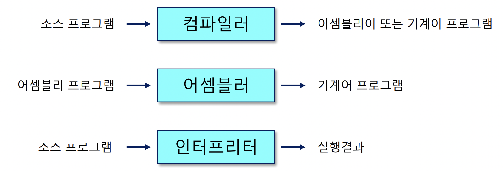
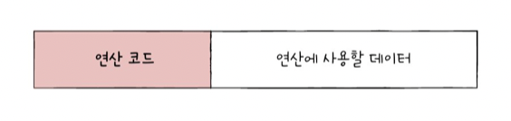
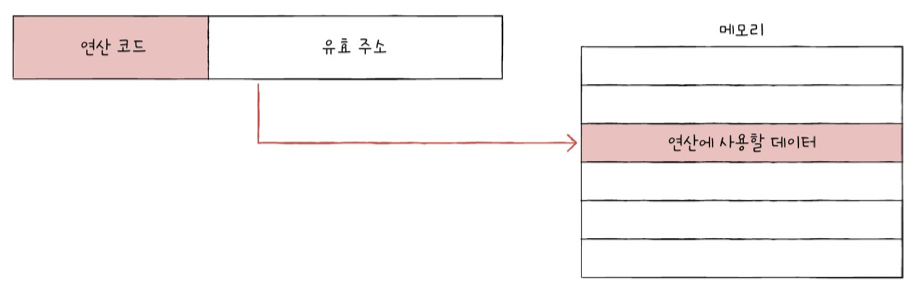
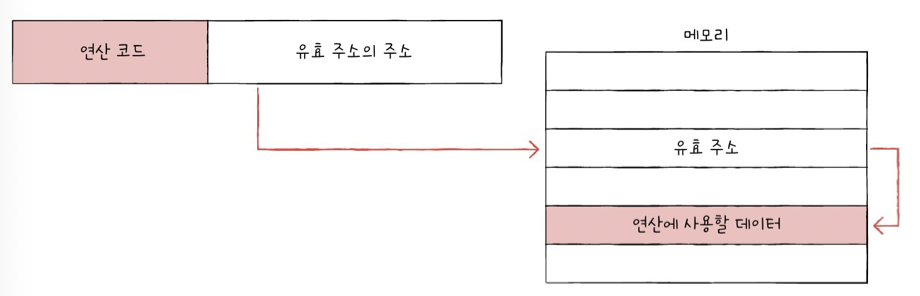
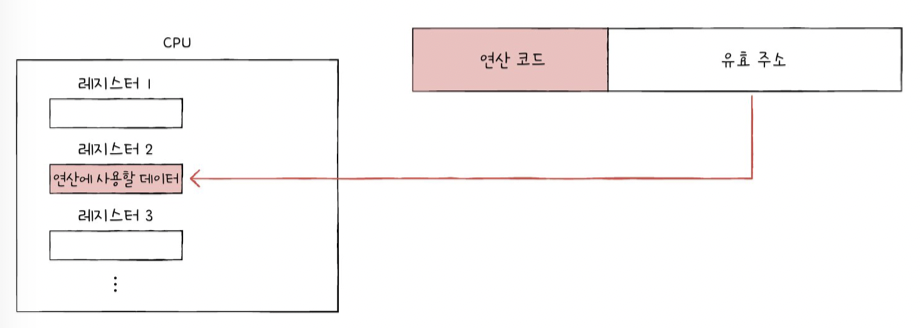
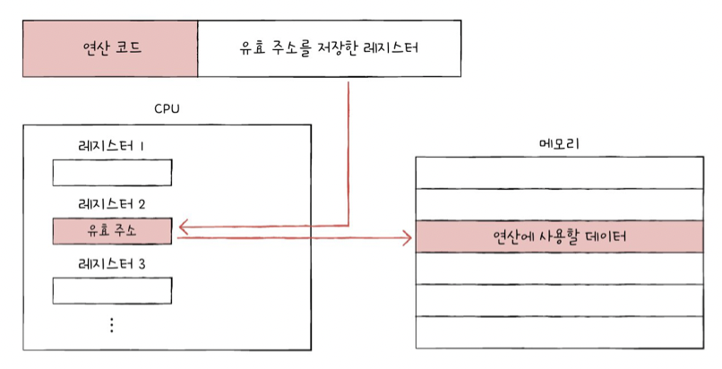

## Chap3. 명령어

<br>

### 3-1. 소스 코드와 명령어

<br>

> **고급 언어와 저급 언어**

**고급 언어**: 사람이 이해하고 작성하기 쉽게 만들어진 언어 (C, C++ 등)

**저급 언어**: 컴퓨터가 이해하고 실행할 수 있는 언어
- 기계어: 0과 1의 명령어 비트로 구성된 언어, 2진수 혹은 16진수로 표현 -> 사람이 이해할 수 없음
- 어셈블리어: 기계어를 읽기 편한 형태로 번역한 언어 (ex. mov a, b)

고급 > 저급 언어로 **변환**해야 개발자가 작성한 코드를 컴퓨터가 이해할 수 있음

<br>

> **컴파일 언어와 인터프리터 언어**

고급 언어를 저급 언어로 변환하는 방식에 따라 크게 **컴파일** 방식과 **인터프리트** 방식으로 구분

- 컴파일 언어: 소스 코드 전체가 저급 언어로 변환되는 고급 언어 (ex. C)

- 인터프리터 언어: 소스 코드가 한 줄씩 실행되는 고급 언어 (ex. Python)



인터프리터 언어가 컴파일 언어보다 느림

<br>

> **목적 파일 vs 실행 파일**

- 목적 파일: 소스코드를 컴파일 해서 나온 파일 (main.c > main.o)
- 실행 파일: 목적 파일에 없는 외부 기능들을 연결 짓는 '링킹' 작업이 진행된 파일

<br>

### 3-2. 명령어의 구조

<br>

> **연산 코드와 오퍼랜드**
- 연산 코드: 명령어가 수행할 연산, 연산자
- 오퍼랜드: 연산에 사용할 데이터 혹은 데이터가 저장된 위치, 피연산자

```
연산 코드 필드 | 오퍼랜드 필드
add A, B
mov a, 0
```

<u>오퍼랜드</u>

0-주소 명령어
```
ret
```
1-주소 명령어
```
pop rbp
```
2-주소 명령어
```
mov eax, 0
```
3-주소 명령어 ...

<br>

<u>연산 코드</u>

**데이터 전송** <br>
MOVE: 데이터 옮기기 <br>
STORE: 메모리에 저장하기 <br>
LOAD(FETCH): 메모리 > CPU 데이터 가져오기 <br>
PUSH: 스택의 최상단에 데이터 추가하기 <br>
POP: 스택의 최상단 데이터 가져오기

<br>

**산술/논리 연산** <br>
ADD / SUBTRACT / MULTIPLY / DIVIDE: 사칙연산 하기 <br>
INCREMENT / DECREMENT: 피연산자에 1 더하기, 1 빼기 <br>
AND / OR / NOT: AND / OR / NOT 연산하기 <br>
COMPARE: 두 개의 숫자 또는 T/F 값 비교하기

<br>

**제어 흐름 변경** <br>
JUMP: 특정 주소로 실행 순서 이동 <br>
CONDITIONAL JUMP: 조건에 부합할 시 특정 주소로 이동 <br>
HALT: 프로그램의 실행 중단 <br>
CALL: 되돌아올 주소를 저장한 채 특정 주소로 실행 순서 이동 <br> 
RETURN: CALL 할 때 저장했던 주소로 되돌아가기 <br>

<br>

**입출력 제어** <br>
READ(INPUT): 데이터 읽기 <br>
WRITE(OUTPUT): 데이터 쓰기 <br>
START IO: 입출력 장치 시작 <br>
TEST IO: 입출력 장치 상태 확인 <br>

<br>

> **주소 지정 방식** 

<br>

- 오퍼랜드 필드에 연산 코드와 연산에 사용될 데이터로 구성하지 않고, **메모리나 레지스터의 주소**를 담는 이유는? <br>
오퍼랜드 필드에 많은 공간을 할당할 수 없기 때문 > 주소값으로 표현할 수 있는 정보의 가짓수를 증가시키기 (메모리 or 레지스터 크기만큼)

- 유효 주소: 연산의 대상이 되는 데이터가 저장된 위치
- 주소 지정 방식: 유효 주소를 찾는 방법

<u>즉시 주소 지정 방식 (연산에 사용될 데이터)</u> <br>
연산에 사용할 데이터를 오퍼랜드 필드에 직접 명시 <br>
표현할 수 있는 데이터의 크기 작지만, 탐색 시간 빠름



<u>직접 주소 지정 방식 (메모리 유효 주소)</u> <br>
오퍼랜드 필드에 유효 주소를 직접 명시하는 방식 <br>
즉시 주소 지정 방식보다는 표현할 수 있는 데이터의 크기 증가, 연산코드를 제외한 나머지 영역에만 유효 주소를 표현할 수 있음



<u>간접 주소 지정 방식 (유효 주소의 주소)</u> <br>
유효 주소의 주소를 오퍼랜드 필드에 명시 <br>
표현할 수 있는 유효 주소의 범위 증가, 두 번의 메모리 접근으로 시간 느림



<u>레지스터 주소 지정 방식 (레지스터 유효 주소)</u>
레지스터의 유효 주소를 명시하는 방식 <br>
데이터 접근이 빠르지만, 표현할 수 있는 레지스터 크기에 제한이 있음



<u>레지스터 간접 주소 지정 방식 (유효 주소를 저장한 레지스터)</u> <br>
연산에 사용할 데이터를 메모리에 저장, 그 유효 주소를 저장한 레지스터를 오퍼랜드 필드에 명시 <br> 
간접 주소 지정 방식과 원리는 비슷, 메모리 접근 횟수가 1번으로 줄어들어 시간 빠름



<br>

> **스택과 큐**
- 스택: LIFO(Last In First Out, 후입선출)
- 큐: FIFO(First In First Out, tjsdlqtjscnf)